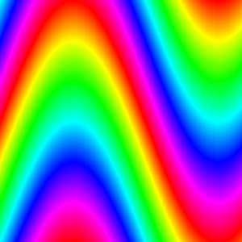
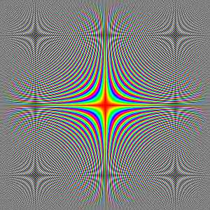
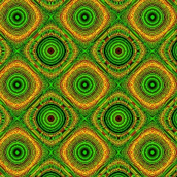

Procedural texture


# images

 
 
 
 
 


 
 
 
 
 


 
 

 


# run

On linux ( tested on Ubuntu 20.04): 
```
wine ./Rainbow.exe
```


# History

   

Old ( but still interesting) Pascal ( Delphi)  program Rainbow for windows ( but can also be run on Linux using wine)

old www address: fraktal.republika.pl/tecza.html


# Git


create a new repository on the command line

```git
echo "# Procedural-texture" >> README.md
git init
git add README.md
git commit -m "first commit"
git branch -M main
git remote add origin https://github.com/adammaj1/Procedural-texture.git
git push -u origin main
```               


## Subdirectory

```git
mkdir images
git add *.png
git mv  *.png ./images
git commit -m "move"
git push -u origin main
```
then link the images:

```txt
 

```

```git
gitm mv -f 
```

## markdown
* [mastering-markdown](https://guides.github.com/features/mastering-markdown/)

## authenticate

[automatically-authenticate-into-github](https://stackoverflow.com/questions/28298861/how-to-automatically-authenticate-into-github-from-git-bash-using-my-public-and)  

```git
git remote set-url origin git@github.com:adammaj1/Procedural-texture.git
```
