[Procedural texture](https://en.wikipedia.org/wiki/Procedural_texture) 
* 2D [color gradient](https://en.wikipedia.org/wiki/Color_gradient). For 1D color gradient see [here](https://gitlab.com/adammajewski/color_gradient)
* [defined by a function whose value is computed rather than looked up](http://math.hws.edu/graphicsbook/c7/s3.html)


# images


## pascal images (up to 24 bit color)

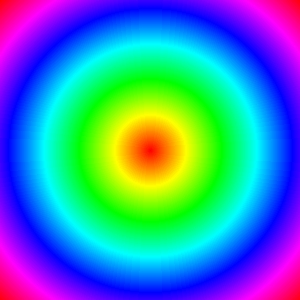 
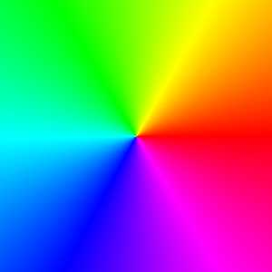 
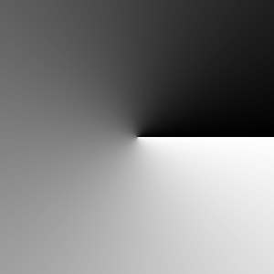 
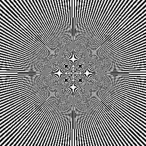 
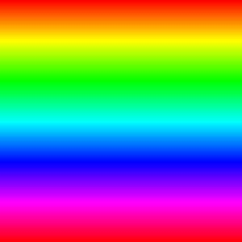 
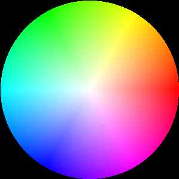 

### max(x,y)
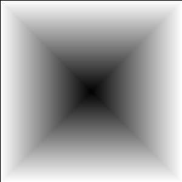 
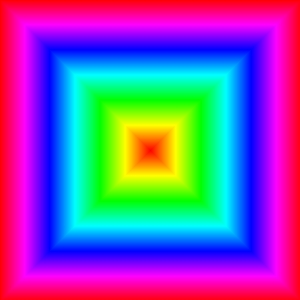 

### xor

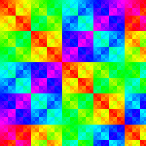 

### sin 

### sin(x)
,  24 bit color ") 


#### sin(x*y)
; single pattern ,  24 bit color") 
; repeating pattern, 24 bit color") 

#### sin(x) + sin(y)
 + sin(y), rgb = 24 bit color") 
 + sin(y), gray = 8 bit color") 
 + sin(y), black and white = 1 bit color") 
 + sin(y), indexed color ( palette)") 


#### sin(x) + sin(y) + sin(x+y)

 + sin(y) + sin(x+y),  indexed color from palette") 
 + sin(y) + sin(x+y), black and white = 1 bit color ") 

### whirl
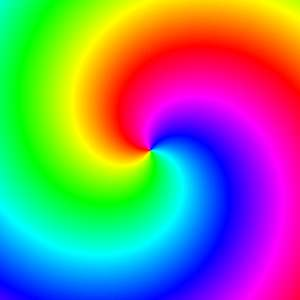 


## gray = 8 bit color ( c images ) 

### cabs(z)

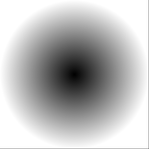 
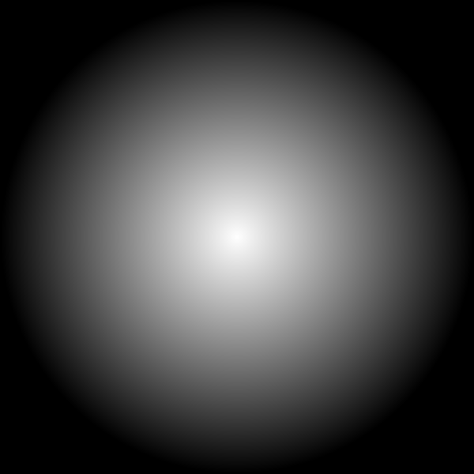 

### carg(z)
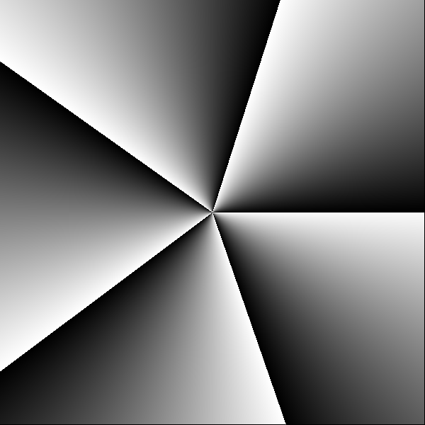 
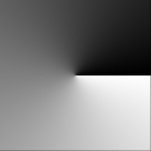 
 

### max min

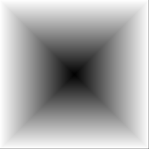 
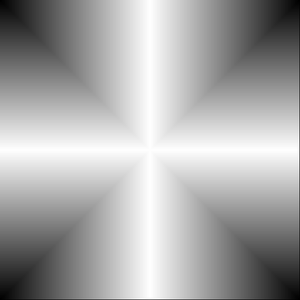 

### star 8
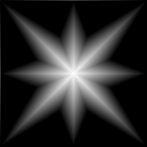 
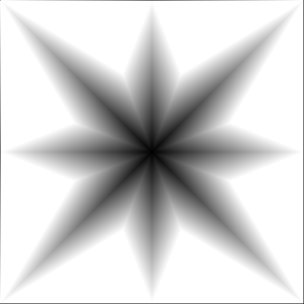 

### himmelblau function
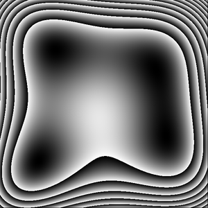 

### checkerboard and grid

#### cartesian
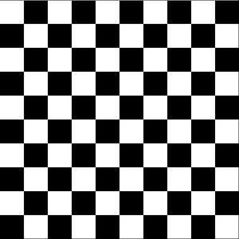


#### polar
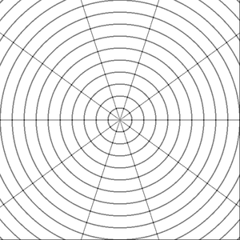 
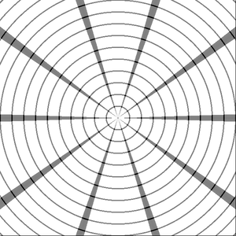 

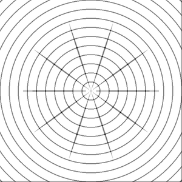 
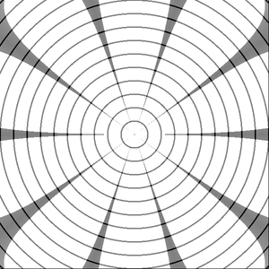 

Compare with:
* [grid for binary decomposition](https://gitlab.com/adammajewski/my-book#129-generating-a-grid)

# Theory
[Procedural textures are 2D or 3D plots of mathematical functions (called procedures)](https://knowledge.autodesk.com/support/maya/learn-explore/caas/CloudHelp/cloudhelp/2016/ENU/Maya/files/GUID-B2C969C0-48CD-45AB-8C7B-E6FC9E34AD19-htm.html) 


Parts
* 2D [scalar field](https://en.wikipedia.org/wiki/Scalar_field) ( 2D array , image, [complex plane](https://en.wikipedia.org/wiki/Complex_plane)  )
* color
  * modes
  * function f : (R x R) maps to  color
* plane transformations
* Texture Mapping = repeatedly paint the same small picture onto your geometry   
  
  
  
  

## color modes
* color depth
* color from palette


[Color depth](https://en.wikipedia.org/wiki/Color_depth)
* 24 bit color (rgb) 
* 8 bit color mode: gray shades ( where r=g=b)
* 1 bit color mode: Black and White ( b&w )


```pas
 case ColorType of
                    TrueColor: if FunctionType=HSV   // 24 bit color
                    	then kolor:=k 
                    	else kolor:=Rainbow(kMin,kMAx,k mod kmax);
                    Direct:    kolor:=k;
                    GrayScale: kolor:=GrayScaleF(Round((k*256) div kmax)); // 8 bit color
                    Pseudo8bit:kolor:=GivePseudo8bitColor(k mod 255);
                    BlackAndWhite: if odd(k) then kolor:=clBlack // 1 bit color
                                         else kolor:=clWhite;
                  end; // case  ColorType }
```


## color functions


Function
* input: the texture coordinates: ( x,y)
* output: a color value


# Color functions
## pascal
For color functions in pascal ( Delphi) see file: [ColorM.pas](./src/pas/ColorM.pas)

Here input is a pair of integers (x,y): 
* x in [0, bitmapa.width-1]
* y in [0, bitmapa.height-1]


```pascal
Function Projection(center:TPoint;height:integer;x,y:integer;FunctionType:TFunctionType):integer;
  // F: C --> R
  //var r:extended; //radius
  begin

     case FunctionType of
            HSV:        result:= Point2Color(X,y);
            AbsZ:       result:=round(sqrt(sqr(X-center.X)+sqr(y-center.Y)));
            ArgZ:       result:=round(RadToDeg(Pi+ArcTan2(y-center.Y,center.X-x)));
            Whirl:      result:=round(sqrt(sqr(X-center.X)+sqr(y-center.Y))+RadToDeg(2*Pi+ArcTan2(y-center.Y,center.X-x)));
            ReZ:        result:=y ;  // horizontal lines
            Saddle:     result:=abs(sqr(x-center.X)-round(sqr(y-center.y) / 2)) ;
            RePlusIm:   result:=y+x;
            MaxReIm:    result:=max(abs(center.x-x),abs(center.Y-y)); // or
            AbsReIm:    result:=abs((center.x-x)*(center.Y-y));           // biomorph
            ImDivRe:    result:=floor(tan((center.Y-y) / (center.X-x+0.000001)));  //
            ImReDiv:    result:=y+x+(100*y div (x+1));
            manhattan:  result:=sqr(abs(center.X-x)+abs(center.Y-y));                                                              // ClientHeight*(sin+1)/2= [0,ClientHeight]

            sinusX:     result:=round(bitmapa.Width*sin(Pi*DegToRad(x)));
            Sinus:      result:=y+round(height*(sin(Pi*DegToRad(x))+1)/8);
            // sin   is in  [-1,+1]
            // (sin+1)      [0,2]
            // (sin+1)/2    [0,1]
            SinusXY:    result:=y+round(height*(sin(Pi*DegToRad(x + y))+1)/8);
            SinusXmY:   result:=y+round(height*(sin(Pi*DegToRad(x*y))+1)/8);
            SinXSinY:   result:=round((height * (2+sin(Pi*DegToRad(y)) + sin(Pi*DegToRad(x)))) /4);//try to change numerical values
            sinXYXY:     result:=round ( height * (2+sin(Pi*DegToRad(y)) + sin(Pi*DegToRad(x))+sin(Pi*DegToRad(x+y)))/8 );
            XorY:         result:=x or  y;
            XxorY:        result:=x xor y;
            XshlY:        result:=x shl y;
            XshrY:        result:=x shr y;
            XandY:        result:=x and y;
            sqrtM:        result:=round(sqrt(x*y)) ;
            ftMax:        result:=Round((center.Y-y) / sqr(center.X -x + 0.0001));
            plasma: result:=round(bitmapa.Width*sin(Pi*DegToRad(x)));
            else          result:=y; //
          end; // case
  end;

```
## c
Here input is a pair of doubles z = (x,y) 
* x in [-1,1]
* y in [-1,1] 


```c
double conic(double complex z)
{
  double argument;
  
  argument = carg(z); //   argument in radians from -pi to pi
  
  argument = fabs(argument)/ M_PI;
      
  return argument; // argument in range from 0.0 to 1.0
}
```

```c

// https://en.wikipedia.org/wiki/Himmelblau%27s_function
double GiveHimmelblau(double x, double y){
	// map input to [-m,m]x[-m,m]
	double m = 6.0;
	x *= m;
	y *= m;
	double a = x*x+y-11.0;
	double b = x+y*y-7.0;
	// mapped output to 
	 return (a*a + b*b)/200.0;

}
```


```c
/*
	https://iquilezles.org/www/articles/checkerfiltering/checkerfiltering.htm
	checkers, in mod form
*/
double checker( double x, double y){

	double m = 5.0; 
	// map input from [-1,1]x[-1,1] to [-m,m]x[-m,m]
	int ix = floor(m*x);
	int iy = floor(m*y);


	return abs(ix + iy) % 2;


}
```

```c
/* 
 r is the smooth potential and phi is the final angle
 code by xenodreambuie : "I call this texture pyramids. My code in Pascal for the Star8 texture is "
 
 
*/ 

double GiveStar8(double r, double phi){
	double fr;
	double fphi;
	double t;
	double g;
	
	fr = fabs(frac(r));
  	fphi = fabs(frac(phi));
  	if (fphi>fr) {
    		t= fr; 
    		fr= fphi; 
    		fphi=t;
    		}
  
	g = 1+1.5*fphi-2.5*fr;
	t = 1-2.5*fphi-fr;
	if (t> g) 
	  	{ g = t;}
	if (g<0)
  		{g=0;}
  	
	return g;
}
```

The checkerboard pattern is regular grid of equal-sized colored squares


# files
* [ColorM.pas](./src/pas/ColorM.pas)  
* [Rainbow.exe](./exe/Rainbow.exe) - windows executable program, can be run also on linux
* [d.c](./src/c/d.c) - c version of Rainbow program
* [g.sh](./src/c/g.sh) bash script for converting ppm files to png


# See also
## functions
* [Test functions for optimization in wikipedia] (https://en.wikipedia.org/wiki/Test_functions_for_optimization)
* [heman](https://github.com/prideout/heman) -  a tiny MIT-licensed C library of image utilities for dealing with height maps, normal maps, distance fields,
* [Mixture](https://github.com/alelievr/Mixture) - s a powerful node-based tool crafted in unity to generate all kinds of textures in realtime
* [TextureSynthesis](https://github.com/mxgmn/TextureSynthesis) - 
* [Texture Analysis and Synthesis ](https://graphics.stanford.edu/projects/texture/)
* [Representation and Synthesis of Visual Texture by Javier Portilla and Eero P. Simoncelli](http://www.cns.nyu.edu/~lcv/texture/index.php)
  * [LabForComputationalVision: textureSynth](https://github.com/LabForComputationalVision/textureSynth)
* [Shader Coding: Space GIF step-by-step by The Art of Code](https://www.youtube.com/watch?v=cQXAbndD5CQ)
* [island-gradient by Code 2D](https://code2d.wordpress.com/2020/07/21/island-gradient/)
* [2D distance functions by inigo quilez ](https://www.iquilezles.org/www/articles/distfunctions2d/distfunctions2d.htm)
* [a-simple-procedural-texture-algorithm by by Herman Tulleken ](http://www.code-spot.co.za/2008/11/07/a-simple-procedural-texture-algorithm/)
* [1D color gradient](https://gitlab.com/adammajewski/color_gradient)
* [ptdesigner](https://github.com/drummyfish/ptdesigner) by drummyfish
* [texture-studio ](http://www.mgsx.net/product/software/2015/09/18/texture-studio.html)
* [create-repeating-patterns-with-cycles-procedural-textures](https://blender.stackexchange.com/questions/26692/how-do-i-create-repeating-patterns-with-cycles-procedural-textures)
* [Sample Procedural Textures from ](https://docs.bentley.com/LiveContent/web/MicroStation%20Help-v13/en/GUID-AC1EEF76-9118-FE2E-32F6-399AF454E86C.html)
* [Textures by  David J. Eck](http://math.hws.edu/graphicsbook/c7/s3.html)
* [what-is-procedural-workflow](https://www.imanvfx.com/what-is-procedural-workflow/)
* [2D textures in Maya](https://knowledge.autodesk.com/support/maya/learn-explore/caas/CloudHelp/cloudhelp/2016/ENU/Maya/files/GUID-EA9BC7E0-22B4-46C1-8D5B-3A4C8B680952-htm.html#GUID-EA9BC7E0-22B4-46C1-8D5B-3A4C8B680952)
* [A-generic-lattice-noise-algorithm-an-evolution-of](https://www.codeproject.com/Articles/785084/A-generic-lattice-noise-algorithm-an-evolution-of)
* [RippleWeave ](https://x-ing.space/rippleweave/) - A function grapher by Xing and ( Ripple Weave Collection Nested trigonometric functions mapped onto HSL space. RippleWeave, 2021.) 

## Chladni patterns
* [Chladni plate interference surfaces Written by Paul Bourke April 2001](http://paulbourke.net/geometry/chladni/)
* [Enrique Zeleny - "Chladni Figures" Wolfram Demonstrations Project Published: December 6 2008](https://demonstrations.wolfram.com/ChladniFigures/)
* [Albert Callejo 2009](http://electricavisuals.com/www.dima-vj.com/chladni/)
* [vasyan on FF](https://fractalforums.org/fractal-mathematics-and-new-theories/28/experiments-with-chladni-patterns/2889)
  * [gallery](https://fractalforums.org/index.php?action=gallery;su=user;cat=88;u=732)
* Evgeny Demidov
  * [chladni](https://www.ibiblio.org/e-notes/html5/wave5.html)
  * [waves](https://www.ibiblio.org/e-notes/webgl/waves/linear.htm)
* [Tonoscope](https://www.youtube.com/watch?v=PkOAnfXlA5M)
* [shadertoy](https://www.shadertoy.com/results?query=tag%3Dchladni)
* [dmackinnon](https://github.com/dmackinnon1/chladni)
  * [r_examples](https://github.com/dmackinnon1/r_examples/tree/master/chladni) and [blog](http://www.mathrecreation.com/2016/06/more-chlandi-figures-in-r.html)
* [inéquation à 2 inconnues by Patrick Clément](https://www.geogebra.org/m/Wmxps3zA#material/yHxqaUcb)

## 2D noise
* [Pocedural_Noise(2f)](http://physbam.stanford.edu/cs448x/old/Procedural_Noise(2f)Perlin_Noise.html)
* [FastNoise by Auburn](https://github.com/Auburn/FastNoise/)


## transformations 
* [imitate-a-textured-sphere-in-2d](https://gamedev.stackexchange.com/questions/147193/imitate-a-textured-sphere-in-2d)

## Midpoint Displacement fractal
* [Midpoint Displacement Fractals by Faber](https://nexus316.wordpress.com/fractals/plasma/) and [aplet](https://sites.google.com/view/fabers-domain/home/math-is-beautiful/midpoint-displacement-fractal-generator)


# run

## pascal

On linux ( tested on Ubuntu 20.04): 
```
wine ./Rainbow.exe
wine ./exe/Rainbow.exe
```


Use: 
* open main menu, choose options item
* choose color mode
* use arrow up and down keys to change functions
* use shift+arrow to change color type 
* check the options in the status bar


# History

   

Old ( but still interesting) Pascal ( Borland Delphi 7.0 personal edition )  program Rainbow for windows ( but can also be run on Linux using wine)

dead old www address: fraktal.republika.pl/tecza.html

Last modification: 2005-05-29 


# Licence and contributors
* [licence](LICENCE) - GNU General Public License v3.0
* function [star8 by xenodreambuie ( pascal) ](https://fractalforums.org/programming/11/how-many-different-ways-are-there-to-show-such-set/3874/msg25389#msg25389)
* FUNCTION HSVtoColor from UNIT HSVLibrary ( efg, July 1999  www.efg2.com/lab  Copyright 1999, All Rights Reserved. May be used freely for non-commercial purposes.
* Function Rainbow by  Witold J.Janik; WJJ@CAD.PL thx for  Andrzeja W¹sika from pl.comp.lang.delphi  http://4programmers.net/view.php?id=201
  

# Git


create a new repository on the command line

```git
echo "# Procedural-texture" >> README.md
git init
git add README.md
git commit -m "first commit"
git branch -M main
git remote set-url origin git@github.com:adammaj1/2D-color-gradient-or-Procedural-texture.git
git push -u origin main
```               


local repo

```bash
~/Pobrane/r20051021 
```


## Subdirectory

```git
mkdir images
git add *.png
git mv  *.png ./images
git commit -m "move"
git push -u origin main
```
then link the images:

```txt
 

```

```git
gitm mv -f 
```

## warning 

## distribute binary 

```
The page build completed successfully, but returned the following warning for the `main` branch:

It looks like you're using GitHub Pages to distribute binary files. We strongly suggest that you use releases to ship projects on GitHub. Releases are GitHub's way of packaging and providing software to your users. You can think of it as a replacement to using downloads to provide software. We found the following file(s) which may be a good candidate for releases: 
```

The only way to prevent these warnings from being sent is to either:
* Remove the executables from your repository
* Store them on a different branch from your Pages publishing source
* Store them outside of the docs directory, if you’re using this directory to host your site


## markdown
* [mastering-markdown](https://guides.github.com/features/mastering-markdown/)

## authenticate

[automatically-authenticate-into-github](https://stackoverflow.com/questions/28298861/how-to-automatically-authenticate-into-github-from-git-bash-using-my-public-and)  

```git
git remote set-url origin git@github.com:adammaj1/Procedural-texture.git
```
