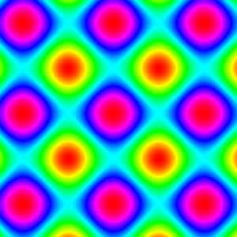
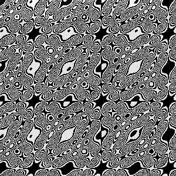
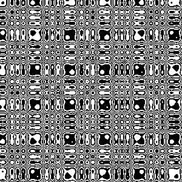
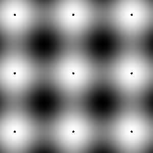

[Procedural texture](https://en.wikipedia.org/wiki/Procedural_texture)


# images

 
 
 
 
 


 
 
 
 
 


 
 
 
 
 


 

 


# Theory
* scalar 2D field 
* function f : (R x R) maps to  R


# Functions

```pascal
Function Projection(center:TPoint;height:integer;x,y:integer;FunctionType:TFunctionType):integer;
  // F: C --> R
  //var r:extended; //radius
  begin

     case FunctionType of
            HSV:        result:= Point2Color(X,y);
            AbsZ:       result:=round(sqrt(sqr(X-center.X)+sqr(y-center.Y)));
            ArgZ:       result:=round(RadToDeg(Pi+ArcTan2(y-center.Y,center.X-x)));
            Whirl:      result:=round(sqrt(sqr(X-center.X)+sqr(y-center.Y))+RadToDeg(2*Pi+ArcTan2(y-center.Y,center.X-x)));
            ReZ:        result:=y ;  // horizontal lines
            Saddle:     result:=abs(sqr(x-center.X)-round(sqr(y-center.y) / 2)) ;
            RePlusIm:   result:=y+x;
            MaxReIm:    result:=max(abs(center.x-x),abs(center.Y-y)); // or
            AbsReIm:    result:=abs((center.x-x)*(center.Y-y));           // biomorph
            ImDivRe:    result:=floor(tan((center.Y-y) / (center.X-x+0.000001)));  //
            ImReDiv:    result:=y+x+(100*y div (x+1));
            manhattan:  result:=sqr(abs(center.X-x)+abs(center.Y-y));                                                              // ClientHeight*(sin+1)/2= [0,ClientHeight]

            sinusX:     result:=round(bitmapa.Width*sin(Pi*DegToRad(x)));
            Sinus:      result:=y+round(height*(sin(Pi*DegToRad(x))+1)/8);
            // sin   is in  [-1,+1]
            // (sin+1)      [0,2]
            // (sin+1)/2    [0,1]
            SinusXY:    result:=y+round(height*(sin(Pi*DegToRad(x + y))+1)/8);
            SinusXmY:   result:=y+round(height*(sin(Pi*DegToRad(x*y))+1)/8);
            SinXSinY:   result:=round(
                              (height
                              *
                              (2+sin(Pi*DegToRad(y)) + sin(Pi*DegToRad(x))))
                              /4
                              );//try to change numerical values
            sinXYXY:     result:=round
                              (
                                height
                                *
                                (2+sin(Pi*DegToRad(y)) + sin(Pi*DegToRad(x))+sin(Pi*DegToRad(x+y)))/8
                                );
            XorY:         result:=x or  y;
            XxorY:        result:=x xor y;
            XshlY:        result:=x shl y;
            XshrY:        result:=x shr y;
            XandY:        result:=x and y;
            sqrtM:        result:=round(sqrt(x*y)) ;
            ftMax:        result:=Round((center.Y-y) / sqr(center.X -x + 0.0001));
            plasma: result:=round(bitmapa.Width*sin(Pi*DegToRad(x)));
            else          result:=y; //
          end; // case
  end;

```

# color modes

* 24 bit color (rgb), color function tecza ( 1D color gradient ) 
* gray shades (skala szarosci where r=g=b)
* direct kolor( kolor 24 bitowy , ale adresowanie bezposrednie wg numerów koloru)
* Black and White 


# run

On linux ( tested on Ubuntu 20.04): 
```
wine ./Rainbow.exe
```


# History

   

Old ( but still interesting) Pascal ( Delphi)  program Rainbow for windows ( but can also be run on Linux using wine)

old www address: fraktal.republika.pl/tecza.html

Last modification: 2005-05-29 

# Git


create a new repository on the command line

```git
echo "# Procedural-texture" >> README.md
git init
git add README.md
git commit -m "first commit"
git branch -M main
git remote add origin https://github.com/adammaj1/Procedural-texture.git
git push -u origin main
```               


## Subdirectory

```git
mkdir images
git add *.png
git mv  *.png ./images
git commit -m "move"
git push -u origin main
```
then link the images:

```txt
 

```

```git
gitm mv -f 
```

## markdown
* [mastering-markdown](https://guides.github.com/features/mastering-markdown/)

## authenticate

[automatically-authenticate-into-github](https://stackoverflow.com/questions/28298861/how-to-automatically-authenticate-into-github-from-git-bash-using-my-public-and)  

```git
git remote set-url origin git@github.com:adammaj1/Procedural-texture.git
```
